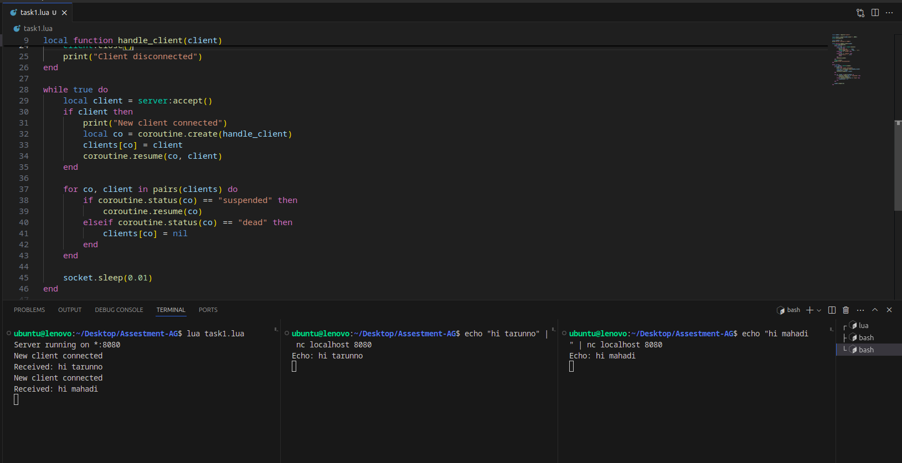
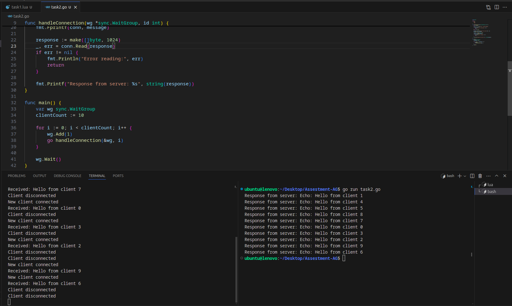

# Multi-Connection Lua Socket Server

This project implements a TCP socket server in Lua that efficiently handles multiple client connections simultaneously.

## Overview

- **Server Setup**: The server listens on port 8080 and uses LuaSocket in non-blocking mode for managing multiple connections.
- **Client Handling**: Each client connection is handled by a separate Lua coroutine, allowing concurrent communication without blocking other connections.
- **Coroutine Management**: Active coroutines are tracked and managed to ensure smooth operation and cleanup of disconnected clients.
- **Event Loop**: The server continuously accepts new connections and manages active ones while using a small sleep interval to optimize CPU usage.

This design ensures the server can handle multiple clients efficiently and reliably.

# Golang Client for Lua Socket Server

This project provides a Go-based client that connects to a Lua-based socket server. The client demonstrates handling multiple connections to the server using Goroutines for concurrent execution.

## Overview

- **Client Functionality**: The Go client connects to a Lua socket server running on `localhost:8080`. It sends a message and receives a response from the server.
- **Concurrency**: The client uses Goroutines to establish multiple simultaneous connections to the server. This allows testing the server's capability to handle multiple clients concurrently.
- **Synchronization**: A `sync.WaitGroup` is used to ensure the main function waits for all Goroutines to complete before exiting.

## How It Works

1. **Connection Handling**: The `handleConnection` function establishes a TCP connection to the server, sends a message, and prints the server's response.
2. **Concurrent Connections**: In the `main` function, multiple Goroutines are launched to create concurrent client connections, simulating multiple clients interacting with the server.

This setup allows you to test and validate the Lua server's performance and concurrency handling by simulating multiple client connections from a Go client.
